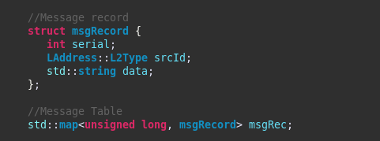

# 009 Messages record 

>Assim como no Projeto 001, a RSU faz agendamentos a cada 2 segundos para o envio de mensagens via broadcast. Desta vez, os veículos mantém um registro das mensagens recebidas. Os campos da mensagem (serial, senderAddress e demoData) são concatenados e um hash é gerado para ser o ID do registro, isso é feito para não haver mensagens repetidas na tabela de mensagens. O mecanismo de armazenamento usado é um MAP com um struct.
 
>As in Project 001, the RSU makes schedules every 2 seconds to send messages via broadcast. This time, the vehicles keep a record of the messages received. The message fields (serial, senderAddress and demoData) are concatenated and a hash is generated to be the record ID, this is done so that there are no repeated messages in the message table. The storage mechanism used is a MAP with structure.


---

```
@dnat
```

