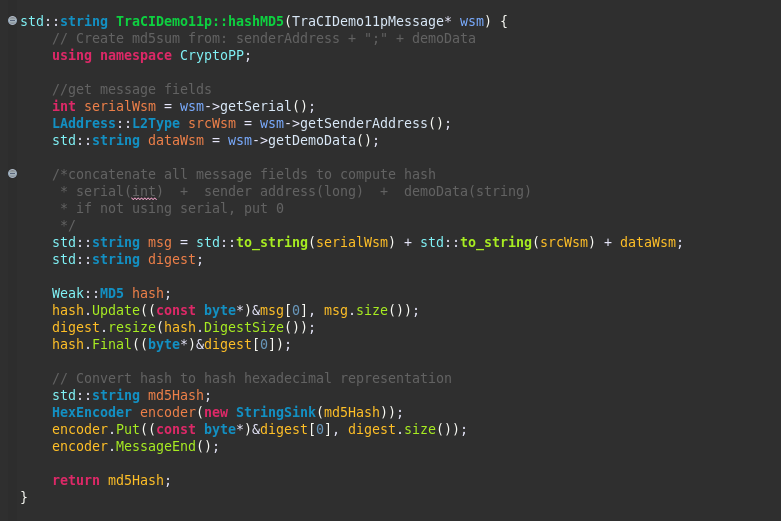

# 011 Messages record (hash MD5) 

>Assim como no Projeto 009, um hash é gerado para ser o ID do registro, isso é feito para não haver mensagens repetidas na tabela de mensagens. Desta vez, foi utilizado o hash MD5 da biblioteca Crypto++. Para funcionar corretamente, é necessário instalar o pacote ```libcrypto++-dev``` e adicionar ```-lcryptopp``` na compilação.
 
>Just as in Project 009 a hash is generated to be the record ID, this is done so that there are no repeated messages in the message table. This time, the MD5 hash from the Crypto++ library was used. To work correctly it is necessary to install the ```libcrypto++-dev``` package and add ```-lcryptopp``` to the compilation.


---

```
@dnat
```

