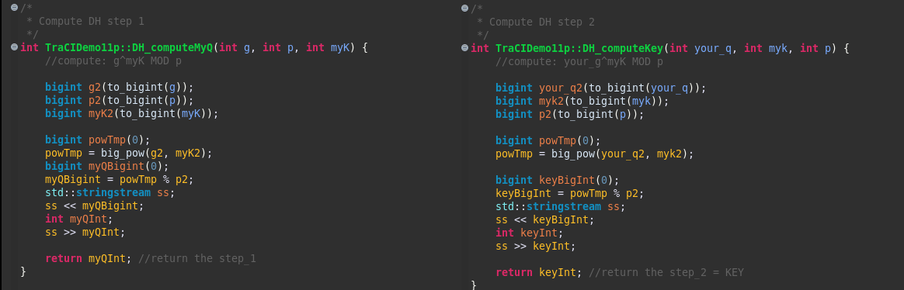

# 012 Diffie-Hellman key exchange 

>Aos 86 segundos de simulação, ALICE envia para BOB os parâmetros escolhidos para troca de chaves Diffie-Hellman. BOB calcula sua parte e envia de volta para ALICE. Desta forma, ambos estão com a mesma chave secreta. O algoritmo Diffie-Hellman foi implementado sem bibliotecas. Foi utilizado apenas a classe ```bigint.h``` para manipulação de números inteiros muito longos.

>At 86 seconds of simulation, ALICE sends the chosen parameters to exchange the Diffie-Hellman keys to BOB. BOB calculates his share and sends it back to ALICE. This way, both have the same secret key. The Diffie-Hellman algorithm was implemented without libraries. Only the ```bigint.h``` class was used to handle very long integers.


---

```
@dnat
```

