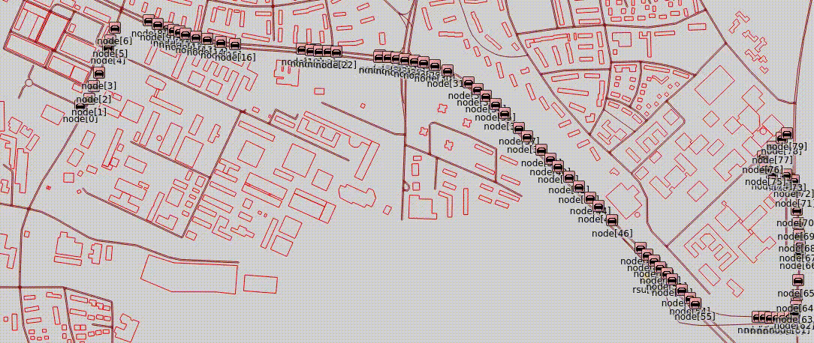
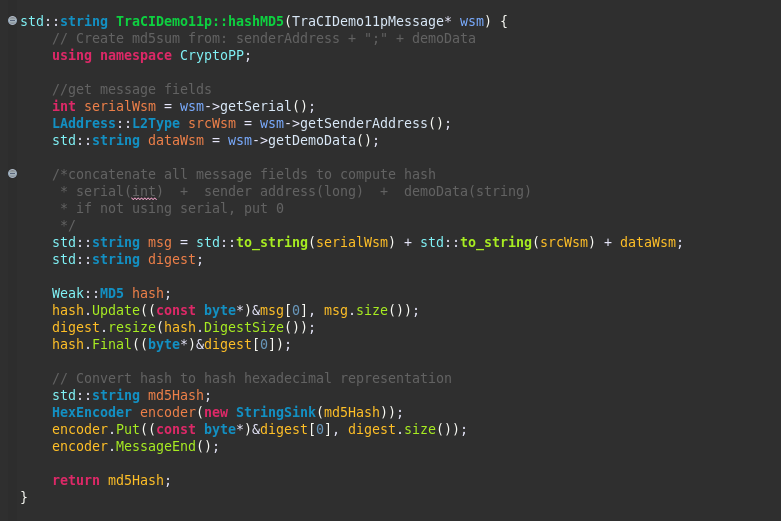

# 01 Simple Projects 
Vanet Projects using Omnet++, SUMO and Veins


**Portugues** 
```
Repositório com vários projetos de rede veicular (VANET)
```

**English** 
```
Repository with various vehicular network projects (VANET)
```

---

### 001 Send broadcast msg from RSU to cars continuously

>A RSU faz agendamentos a cada 2 segundos para o envio de mensagens via broadcast.
>The RSU makes schedules every 2 seconds to send messages via broadcast.
---


### 002 Send broadcast msg from RSU to cars at 65s

>A RSU faz um agendamento para que no tempo de simulação 65s, ela envie uma mensagem em broadcast.
>The RSU makes a schedule so that in the simulation time of 65s, it sends a broadcast message.
---


### 003 Send unicast msg from RSU to a car

>A RSU faz um agendamento para que no tempo de simulação 65s, ela envie uma mensagem em unicast para o veículo de ID 34 (node[3]).
>The RSU makes a schedule so that in the simulation time of 65s it sends a unicast message to the vehicle with ID 34 (node[3]).
---


### 004 Send unicast msg from RSU to a car and wait for response

>A RSU faz agendamentos a cada 2 segundos para o envio de uma mensagens via unicast para o veículo de ID 214 (node[33]). A RSU interrompe o envio somente quando o veiculo que recebeu a mensagem responder a confirmação com o texto: "msg received".
>The RSU makes schedules every 2 seconds to send a message via unicast to vehicle ID 214 (node[33]). The RSU stops sending only when the vehicle that received the message responds to the confirmation with the text: “msg received”.
---


### 005 Some vehicles ping RSU and RSU answer (ping - pong)

>Todos os veículos com IDs multiplos de 5 fazem um "ping" para RSU, que responde com um "pong". Quando o veículo envia o "ping", ele fica amarelo. E quando ele recebe o "pong", fica com um circulo vermelho, verde ou azul a sua volta. É feito um rodizio das cores, para cada "pong" recebido.
>All vehicles with IDs that are multiples of 5 make a “ping” to RSU, which responds with a “pong”. When the vehicle sends the “ping”, it turns yellow. And when he receives the “pong”, he has a red, green or blue circle around him. The colors are rotated for each “pong” received.
---


### 006 RSU send msg via "fake" multicast

>A RSU envia mensagens via broadcast, mas apenas os veículos selecionados processam a menssagem. Foi criado na mensagem, um campo do tipo string chamada multicastAddr, no qual é enviado varios IDs de veículos separados por ';'. Quando o veículo recebe a mensagem, ele verifica se o seu ID está na lista, caso positivo um circulo verde será colocado em volta do veículo.
>The RSU sends messages via broadcast, but only selected vehicles process the message. A string field called multicastAddr was created in the message, in which several vehicle IDs separated by ';' are sent. Upon receiving the message, the vehicle checks whether its ID is on the list, if so, a green circle will be placed around the vehicle.
---


### 007 CAR send msg to another car via RSU

>O veículo de de ID 16 (node[0]) quer enviar uma mensagem para o veículo de de ID 286 (node[45]), mas este ainda não entrou na via. Então, o primeiro veículo envia a mensagem para a RSU que retransmite para o segundo veículo.
Todos os nós permanecem enviando a mensagem a cada 2 segundos até que o destino envie de volta uma confirmação de recebimento.
>Vehicle ID 16 (node[0]) wants to send a message to vehicle ID 286 (node[45]), but this vehicle has not yet entered the lane. Then, the first vehicle sends the message to the RSU which relays it to the second vehicle.
All nodes continue sending the message every 2 seconds until the destination sends back an acknowledgment.
---


### 008 The Telephone Game - CAR sends the message to its neighbor, which forwards it to the next neighbor, until it reaches the last vehicle

>O veículo de de ID 16 (node[0]) envia uma ensagem para o proximo veiculo da fila, ID 22 (node[1]), que reencaminha essa mensagem para o proximo até chegar no último veículo da simulação.
Os nós permanecem retransmitindo a mensagem a cada 2 segundos até que o destino envie de volta uma confirmação de recebimento.
O endereço do nó vizinho é encontrado somando 6 em seu ID (esta é uma caracterisca do simulador).
Os veículos entram na via na cor vermelho e, ao receber a mensagem, mudam sua cor para verde, amarelo, azul ou branco. É feito um rodizio das cores, para cada veículo.
>Vehicle ID 16 (node[0]) sends a message to the next vehicle in the queue, ID 22 (node[1]), which forwards this message to the next one until reaching the last vehicle in the simulation.
The nodes continue to retransmit the message every 2 seconds until the destination sends back an acknowledgment.
The neighboring node's address is found by adding 6 to its ID (this is a simulator feature).
Vehicles enter the road in red and, upon receiving the message, change their color to green, yellow, blue or white. A color rotation is done for each vehicle.


---

### 009 Messages record

>Assim como no Projeto 001, a RSU faz agendamentos a cada 2 segundos para o envio de mensagens via broadcast. Desta vez, os veículos mantém um registro das mensagens recebidas. Os campos da mensagem (serial, senderAddress e demoData) são concatenados e um hash é gerado para ser o ID do registro, isso é feito para não haver mensagens repetidas na tabela de mensagens. O mecanismo de armazenamento usado é um MAP com um struct.
>As in Project 001, the RSU makes schedules every 2 seconds to send messages via broadcast. This time, the vehicles keep a record of the messages received. The message fields (serial, senderAddress and demoData) are concatenated and a hash is generated to be the record ID, this is done so that there are no repeated messages in the message table. The storage mechanism used is a MAP with structure.


---

### 010 Ping-Pong RSU-CA

>O veículo de de ID 22 (node[0]) envia uma ensagem para a RSU de ID 11 (rsu[0]) aos 75 segundos de simulação. Ao receber a mensagem, inicia-se um "ping pong" entre a RSU de ID 11 (rsu[0]) e a CA de ID 16 (ca[0]), na qual é enviada uma mensagem de um para outro até o fim da simulação. Nesta simulação foi incluído mais um elemento na rede chamado CA (Central Authority). A CA funciona basicamente como uma RSU, mas servirá, em exemplos futuros, como um local para centralizar e consolidar as mensagens enviadas pelos veículos na rede.
>Vehicle ID 22 (node[0]) sends a message to RSU ID 11 (rsu[0]) at 75 seconds of simulation. Upon receiving the message, a "ping pong" begins between the RSU with ID 11 (rsu[0]) and the CA with ID 16 (ca[0]), in which a message is sent from one to the other until the end of the simulation. In this simulation, another element was included in the network called CA (Central Authority). The CA basically functions as an RSU, but will serve, in future examples, as a place for centralizing and consolidating messages sent by vehicles on the network.


---


### 011 Messages record (hash MD5)

>Assim como no Projeto 009, um hash é gerado para ser o ID do registro, isso é feito para não haver mensagens repetidas na tabela de mensagens. Desta vez, foi utilizado o hash MD5 da biblioteca Crypto++. Para funcionar corretamente, é necessário instalar o pacote ```libcrypto++-dev``` e adicionar ```-lcryptopp``` na compilação.
>Just as in Project 009 a hash is generated to be the record ID, this is done so that there are no repeated messages in the message table. This time, the MD5 hash from the Crypto++ library was used. To work correctly it is necessary to install the ```libcrypto++-dev``` package and add ```-lcryptopp``` to the compilation.


---


