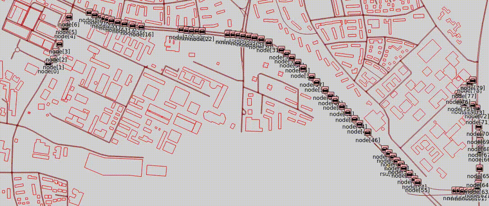
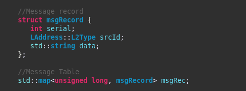

# Vanet-Projects 
Vanet Projects using Omnet++, SUMO and Veins


**Portugues** 
```
Repositório com vários projetos de rede veicular (VANET)
```

**English** 
```
Repository with various vehicular network projects (VANET)
```

---

### 001 Send broadcast msg from RSU to cars continuously

>A RSU faz agendamentos a cada 2 segundos para o envio de mensagens via broadcast.
---


### 002 Send broadcast msg from RSU to cars at 65s

>A RSU faz um agendamento para que no tempo de simulação 65s, ela envie uma mensagem em broadcast.
---


### 003 Send unicast msg from RSU to a car

>A RSU faz um agendamento para que no tempo de simulação 65s, ela envie uma mensagem em unicast para o veículo de ID 34 (node[3]).
---


### 004 Send unicast msg from RSU to a car and wait for response

>A RSU faz agendamentos a cada 2 segundos para o envio de uma mensagens via unicast para o veículo de ID 214 (node[33]). A RSU interrompe o envio somente quando o veiculo que recebeu a mensagem responder a confirmação com o texto: "msg received".
---


### 005 Some vehicles ping RSU and RSU answer (ping - pong)

>Todos os veículos com IDs multiplos de 5 fazem um "ping" para RSU, que responde com um "pong". Quando o veículo envia o "ping", ele fica amarelo. E quando ele recebe o "pong", fica com um circulo vermelho, verde ou azul a sua volta. É feito um rodizio das cores, para cada "pong" recebido.
---


### 006 RSU send msg via "fake" multicast

>A RSU envia mensagens via broadcast, mas apenas alguns veículos selecionados processam a menssagem. Foi criado na mensagem, um campo do tipo string chamada multicastAddr, no qual é enviado varios IDs de veículos separados por ';'. Quando o veículo recebe a mensagem, ele verifica se o seu ID está na lista, caso positivo um circulo verde será colocado em volta do veículo.
---


### 007 CAR send msg to another car via RSU

>O veículo de de ID 16 (node[0]) quer enviar uma mensagem para o veículo de de ID 286 (node[45]), mas este ainda não entrou na via. Então, o primeiro veículo envia a mensagem para a RSU que retransmite para o segundo veículo.
Todos os nós permanecem enviando a mensagem a cada 2 segundos até que o destino envie de volta uma confirmação de recebimento.
---


### 008 The Telephone Game - CAR sends the message to its neighbor, which forwards it to the next neighbor, until it reaches the last vehicle

>O veículo de de ID 16 (node[0]) envia uma ensagem para o proximo veiculo da fila, ID 22 (node[1]), que reencaminha essa mensagem para o proximo até chegar no último veículo da simulação.
Os nós permanecem retransmitindo a mensagem a cada 2 segundos até que o destino envie de volta uma confirmação de recebimento.
O endereço do nó vizinho é encontrado somando 6 em seu ID (esta é uma caracterisca do simulador).
Os veiculos entra na via na cor vermelho. Ao receber a mensagem, o veículo muda sua cor para verde, amarelo, azul ou branco. É feito um rodizio das cores, para cada veículo.


---

### 009 Messages record

>Assim como no projeto 001, a RSU faz agendamentos a cada 2 segundos para o envio de mensagens via broadcast. Desta vez, os veículos mantém um registro das mensagens recebidas. Os campos da mensagem (serial, senderAddress e demoData) são contatenados e um hash é gerado para ser o ID do registro, isso para não haver mensagens repetidas na tabela de mensagens. O mecanismo de armazenamento usado é um MAP com um struct.


---


